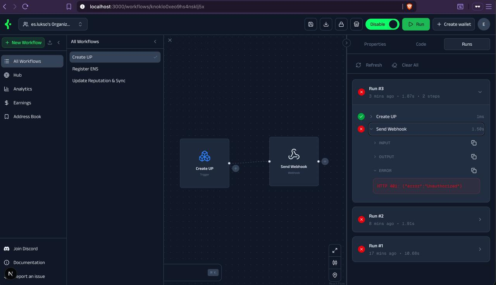
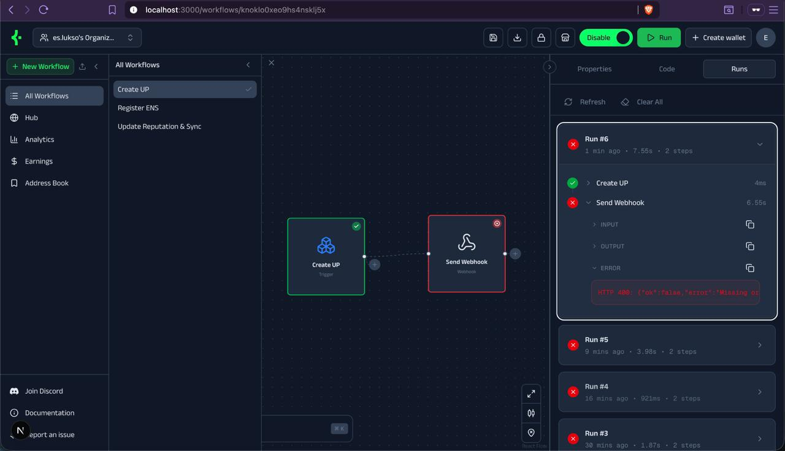
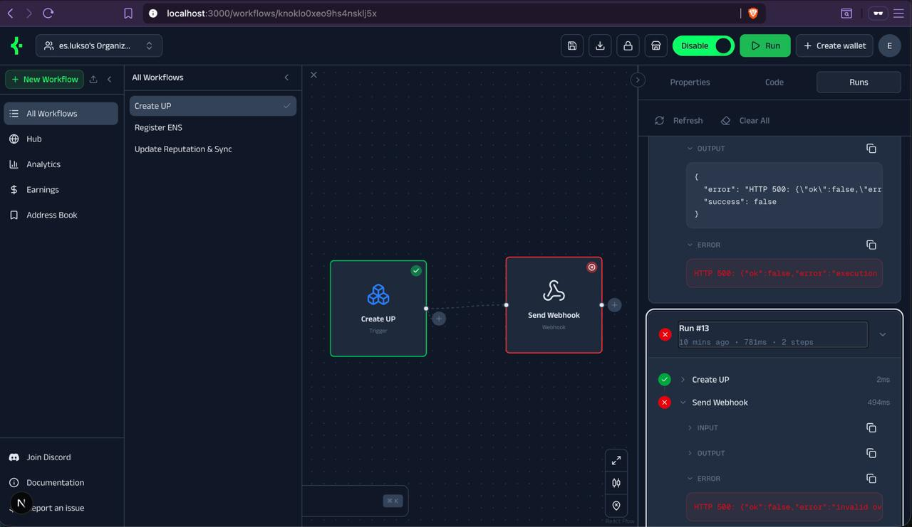

# KeeperHub Feedback — Open Agents Hackathon

## Context

We integrated KeeperHub into a real-world workflow using a non-natively supported chain (LUKSO).

Instead of a superficial test, we implemented a full pipeline:

**Trigger → UP deployment → Webhook → Backend execution → Cross-chain sync**

This allowed us to evaluate KeeperHub under realistic conditions and outside its default environment.

---

## Key Findings

### 1. Lack of clear custom chain integration path

- No documented way to add new chains (RPC, contracts, indexing)
- Required modifying internal logic instead of extending via plugins

**Impact:** Limits adoption in emerging ecosystems and reduces extensibility.

---

### 2. Systematic HTTP errors with low observability

We encountered repeated failures during workflow execution across multiple runs.

#### Evidence (reproducible)

**Run #3 — HTTP 401 Unauthorized**

**Run #6 — HTTP 400 Missing body**

**Run #13 — HTTP 500 Execution error**

- Workflow: Create UP → Send Webhook
- Result: Consistent failure at webhook step
- Errors vary across runs with no clear progression or differentiation

#### Observations

- No differentiation between possible causes: authentication issues, payload issues, backend failures
- Each run produces a different HTTP error code (401, 400, 500) for the same workflow configuration
- No request/response preview at the node level to diagnose root cause

**Impact:** Creates a non-deterministic debugging experience and reduces trust in automation.

> In an agent-based system, unclear failures are worse than failures themselves.

---

### 3. Missing mental model for workflow orchestration

When designing our pipeline (UP deployment → ENS registration → cross-chain reputation sync), we faced a non-obvious architectural decision: one monolithic workflow, or several smaller ones?

We arrived at **three separate atomic workflows**, each triggered by a distinct on-chain event:

| Workflow | Trigger | Chain |
|---|---|---|
| Create UP | MockGensyn event | LUKSO |
| Register ENS | `ProfileRegistered` event | LUKSO |
| Update Reputation & Sync | `ProfileRegistered` event | LUKSO → Sepolia |

This design emerged from constraints that KeeperHub doesn't currently surface or document:

- **Atomicity and idempotency.** Each workflow can be re-run independently on failure without re-executing prior steps. A monolithic workflow would require internal checkpointing or full re-execution.
- **Block confirmation boundaries.** Steps 2 and 3 depend on on-chain state produced by step 1. Waiting for block confirmations inside a single workflow is complex or unsupported depending on the engine.
- **Event-driven causality.** Workflow 2 can only run if workflow 1 emitted `ProfileRegistered` — the event itself is the proof that the UP exists. Causal dependencies live on-chain, not in workflow code.
- **Independent failure isolation.** If the ENS API is down, workflow 2 fails while workflow 3 continues unaffected. A monolithic workflow would cancel all steps on any single failure.

This architecture is correct for cross-chain, event-driven systems. The cost is operational: three triggers to configure, three places to update if the contract changes.

**The gap:** KeeperHub provides no guidance for this decision. There are no documented patterns for multi-step, multi-chain pipelines — leaving teams to rediscover these tradeoffs independently.

**Impact:** Creates architectural ambiguity and slows down development, especially for teams new to onchain automation.

---

## Key Insight

KeeperHub is powerful, but currently behaves more like a **backend execution engine exposed via UI**, rather than a fully designed developer platform.

To become a true execution layer for agents, it needs:

- Extensibility (custom chains)
- Observability (clear errors)
- Composability (workflow structure clarity)

---

## Suggestions

- Introduce a **chain abstraction / plugin system**
- Provide **typed, structured errors** instead of generic HTTP 4xx/5xx
- Add **node-level observability** (logs, request/response previews)
- Define **clear workflow design patterns**
- Support experimental integrations (e.g. LUKSO)

---

## Closing Thought

Right now, KeeperHub feels like *Zapier for onchain workflows*.

The opportunity is bigger: becoming the **trust and execution layer for autonomous agents across chains**.

Our experience suggests that unlocking this vision requires making the system truly extensible and debuggable beyond its current default environment.
